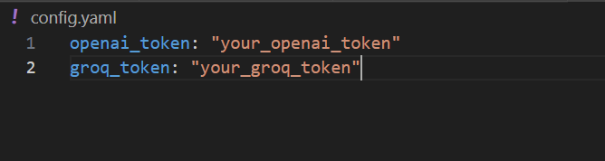

# SKILL
**S**ci**k**it-Learn **I**ntegrate with **L**arge **L**anguage Models (**SKILL**)

## Introduction
This is a modified version of the scikit-llm package developed by the scikit-llm team, with the purpose of enabling it to connect to the free Groq API.

## Quick Start
> git clone git@github.com:shangyuan191/SKILL.git

> conda create -n scikitllm python=3.12

> conda activate scikitllm

> pip install scikit-llm

> pip install groq

You need to follow the tutorial in the reference section below to generate your own groq api token and replace the "your_groq_token" in config.yaml

> python main.py

## reference
* #### scikit-llm github: https://github.com/iryna-kondr/scikit-llm
* #### webpage tutorial: https://skllm.beastbyte.ai/
* #### openai-api and groq free api tutorial: https://ithelp.ithome.com.tw/m/articles/10351845
* #### groq: https://console.groq.com/
